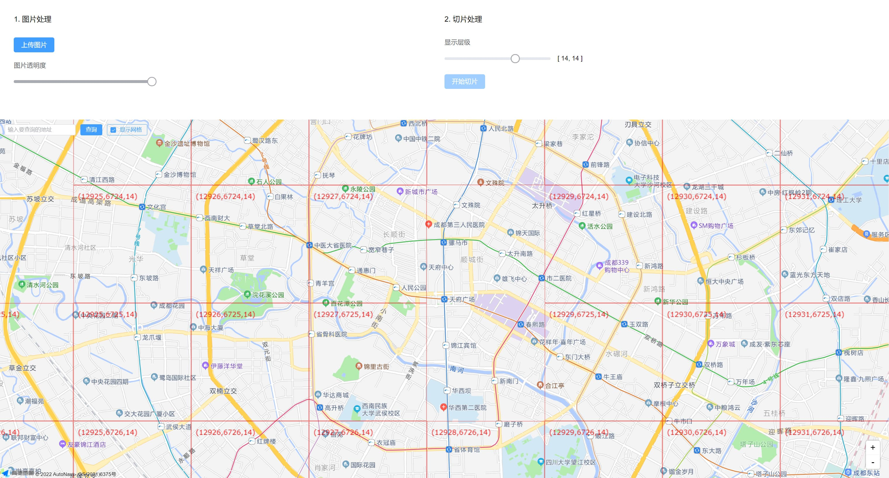

# amap-tiles-cutter

> &emsp;   
> 专用于高德地图的地图瓦片分层切割工具  
&emsp;

&emsp;
## 介绍
本项目是为了开发风格化地图导览项目而制作的专用工具。 


&emsp;

## 使用方法
1. 找设计师拿到手绘地图。
2. 上传手绘地图。
3. 降低图片透明度，对齐手绘地图到正确的地理位置。
4. 选择需要切割的层级。比如15-17级。
5. 点击开始切片。
6. 在地图导览项目中，通过如下代码来使用地图瓦片：
```javascript
AMapLoader.load({
  "key": "xxxxxxxxxxxxxxxxxxxxxxxxxxxxxxxx",  // 申请好的Web端开发者Key，首次调用 load 时必填
  "version": "2.0",                           // 指定要加载的 JSAPI 的版本，缺省时默认为 1.4.15
  "plugins": ['AMap.MoveAnimation'],          // 需要使用的的插件列表，如比例尺'AMap.Scale'等
}).then((AMap: any) => {
  const layer = new AMap.TileLayer.Flexible({
    cacheSize: 120,
    zooms: [15, 17],
    createTile: (x: number, y: number, z: number, success: Function, fail: Function) => {
      const img = new Image();
      img.src = `/static/map/${z}/tile_${x}_${y}.png`;
      img.crossOrigin = 'Anonymous';
      img.onload = () => {
        success(img);
      }
      img.onerror = () => {
        fail();
      }
    }
  })
  map = new AMap.Map('container', {
    center: [104.065752,30.657465],
    zoom: 16,
    zooms: [15, 17],
    rotateEnable: false,
    features: ['bg', 'road'],
    showLabel: false,
    showBuildingBlock: false,
    showIndoorMap: false,
    layers: [
      AMap.createDefaultLayer(),
      layer
    ]
  });
})
```